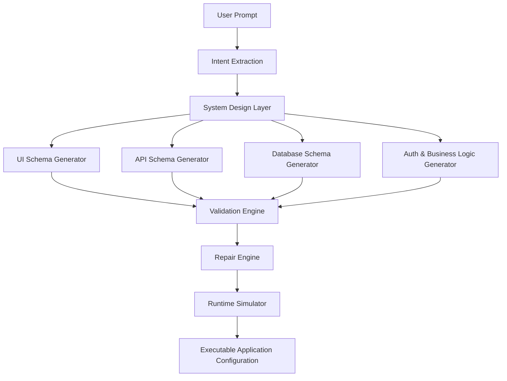

# AI App Compiler

A production-oriented, deterministic compiler pipeline for turning natural-language app briefs into validated, repairable, executable configurations.

## Project Highlights
- Modular backend compiler pipeline with intent extraction, system design, schema generation, validation, repair, runtime simulation, confidence scoring, dependency graph generation, and evaluation metrics.
- Interactive frontend dashboard for prompt input, validation, repair summaries, assumptions, confidence scores, dependency graph visualization, runtime simulations, and evaluation reporting.
- Deterministic behavior with no external LLM dependency, making it suitable for reproducible demonstrations and internship submissions.

## Repository Structure
- `backend/` — Express + TypeScript compiler API and deterministic pipeline.
- `frontend/` — Next.js 16 dashboard for visualization and interaction.
- `docs/` — Architecture, setup, and evaluation documentation.
- `screenshots/` — Local screenshots of the UI for submission artifacts.

## Technology Stack
- Backend: Node.js 22, Express, TypeScript, Zod, tsx
- Frontend: Next.js 16, React 19, Tailwind CSS

## Local Setup
1. Install backend dependencies:
   - `cd backend && npm install`
2. Install frontend dependencies:
   - `cd frontend && npm install`
3. Start the backend:
   - `cd backend && npm run dev`
4. Start the frontend:
   - `cd frontend && npm run dev`

## Verification and Validation
This repository has been verified with fresh automation runs:
- Backend tests: `cd backend && npm test`
- Backend build: `cd backend && npm run build`
- Frontend build: `cd frontend && npm run build`
- Runtime verification:
  - Backend API: `http://localhost:4000/api/compile`
  - Frontend dashboard: `http://localhost:3000`
    
## Architecture Overview

## Pipeline Stages

1. **Intent Extraction**
   - Extracts entities, workflows, roles, and constraints from natural language.

2. **System Design Layer**
   - Converts extracted intent into application architecture decisions.

3. **Independent Schema Generators**
   - Generates:
     - UI schemas
     - API schemas
     - Database schemas
     - Authentication rules
     - Business logic configurations

4. **Validation Engine**
   - Detects:
     - schema inconsistencies
     - missing fields
     - invalid relations
     - permission conflicts
     - logical contradictions

5. **Repair Engine**
   - Selectively regenerates only affected modules instead of restarting the entire pipeline.

6. **Runtime Simulator**
   - Verifies that generated configurations are executable and internally consistent.
     
## Evaluation
The evaluation harness runs the compiler across a curated set of prompts and reports success rate, validation failures, repair activity, and repair success rate. The current run is available through the frontend evaluation dashboard and the backend `runEvaluation()` flow.

## Screenshot Artifact
A local dashboard screenshot is available at `screenshots/home.png`.

## Notes
- Generated artifacts are written to `backend/data` for reproducibility and inspection.
- The compiler is intentionally rule-based and transparent, making each repair and assumption visible in the UI.
