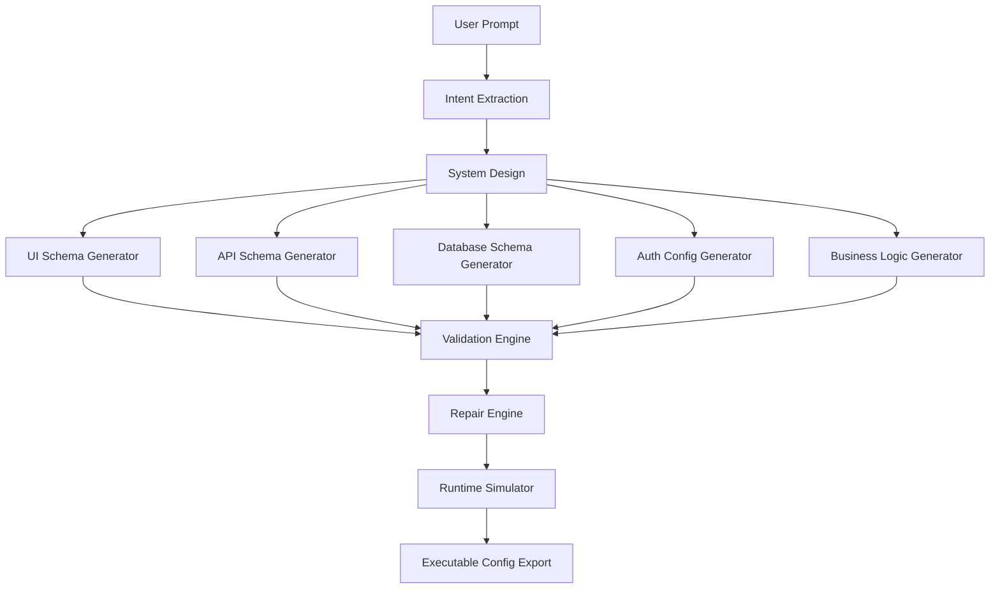

# Architecture Diagram

## Pipeline highlights
- Deterministic intent extraction with strict schemas
- Independent module generation for UI, API, database, auth, and business logic
- Cross-layer validation and targeted repair
- Runtime simulation for routes, permissions, forms, and DB operations
